# AUX PROJECT 1: SHELL SCRIPTING

Lunch Ubuntu server instance in AWS EC2
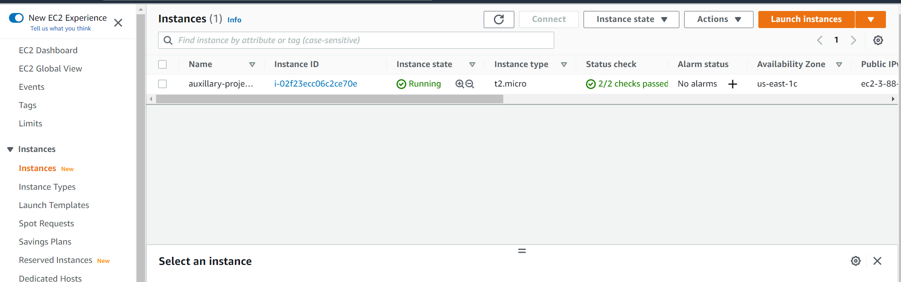

Create a project folder called Shell and change the directory to Shell
`mkdir Shell && cd Shell`

In the new directory, use a text editor to add the names of users to onboard `nano names.csv id_rsa.pub onboarding_users.sh`

Open and populate with names.csv, one entry per line. Save and exit.
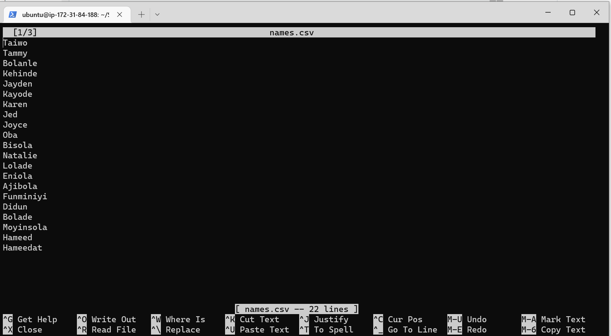

Open and populate the id_rsa.pub file the public key. Save and exit.
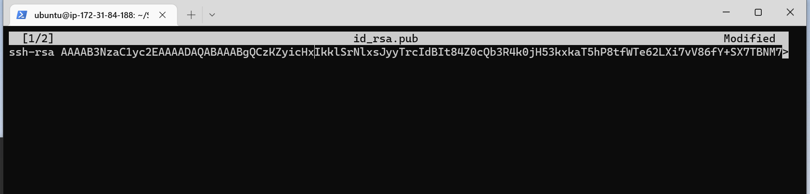

Add shell script to automate the onboarding of 20 users. Save and exit.
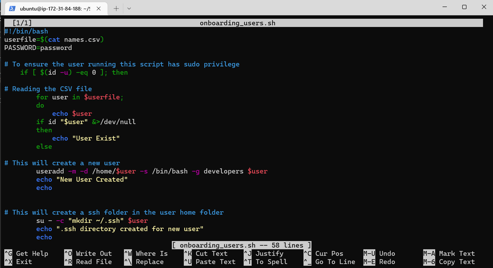

Create the developers group
`sudo groupadd developers`
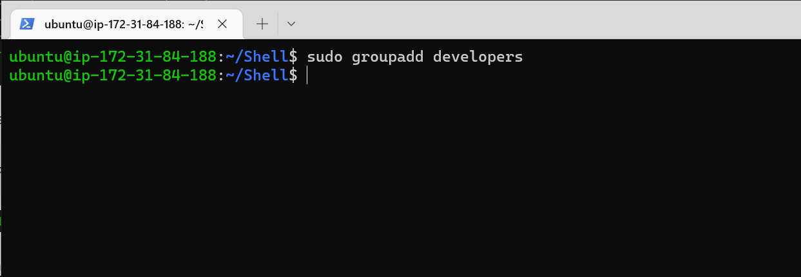

Make the shell script executable
`sudo chmod +x onboarding_users.sh`
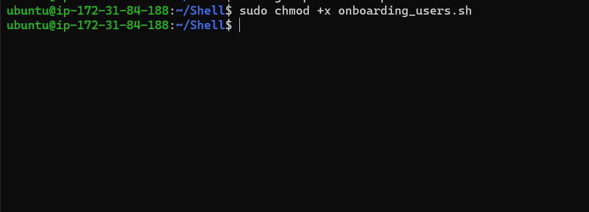

Change user to super and run script.
`sudo su`
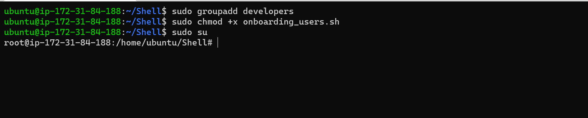

To verify that users are successfully created
`./onboarding_users.sh`
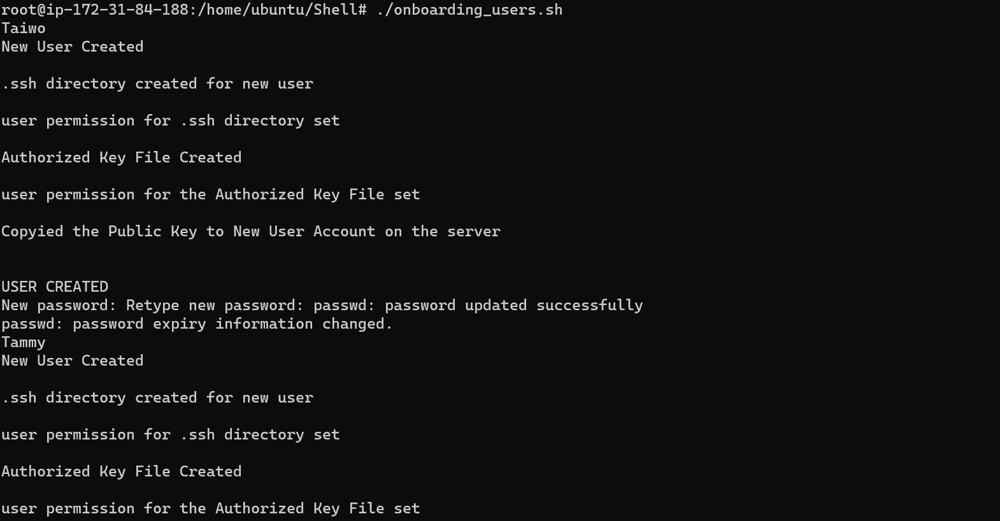

To check the users, change the directory back to home 
`cd ../..`
`ls -la`
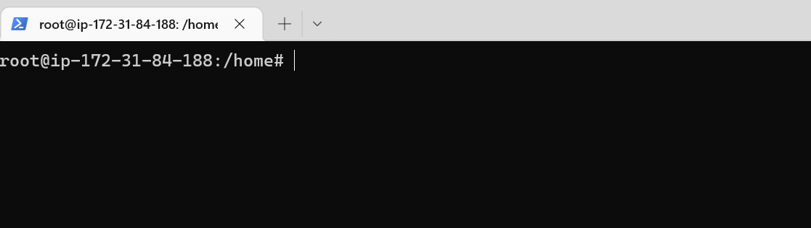
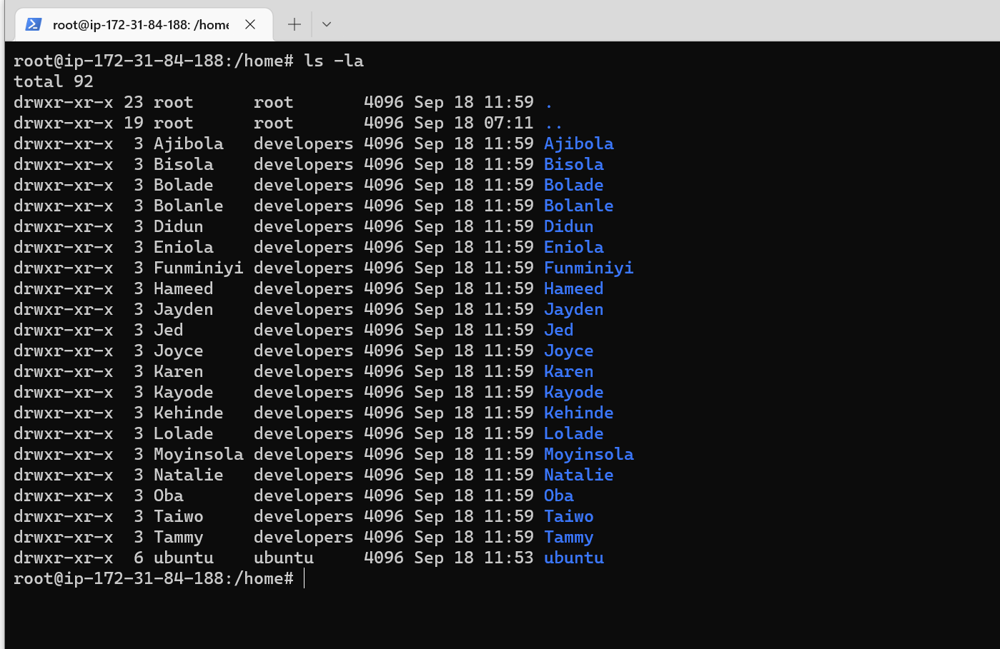

To check if the developers group has been created
`getent group developers`
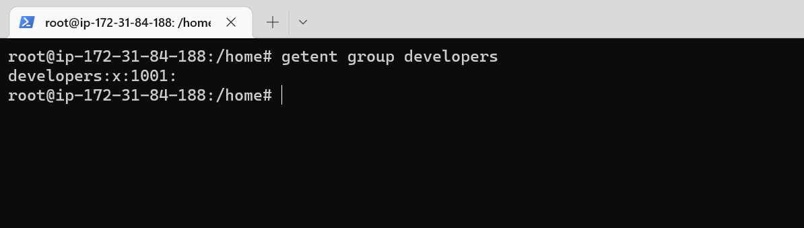

The developers will need the private key to connect to the ssh server, to create the private key

Open a notepad, copy and paste the private key into it and save it as 'aux-proj.pem'
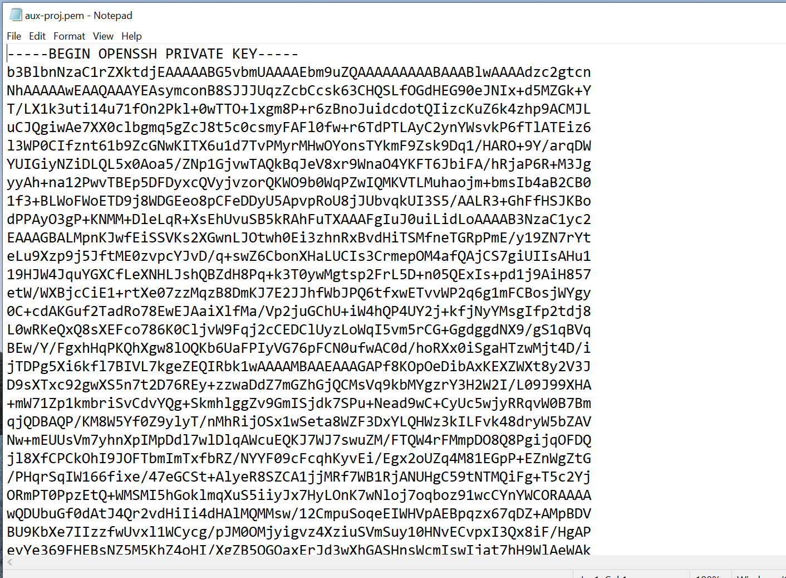

I will be using putty to sign one of the onboarding users 'Tammy' to sign in to the ssh client 
Open putty and load the aux-project.pem file and save as private key
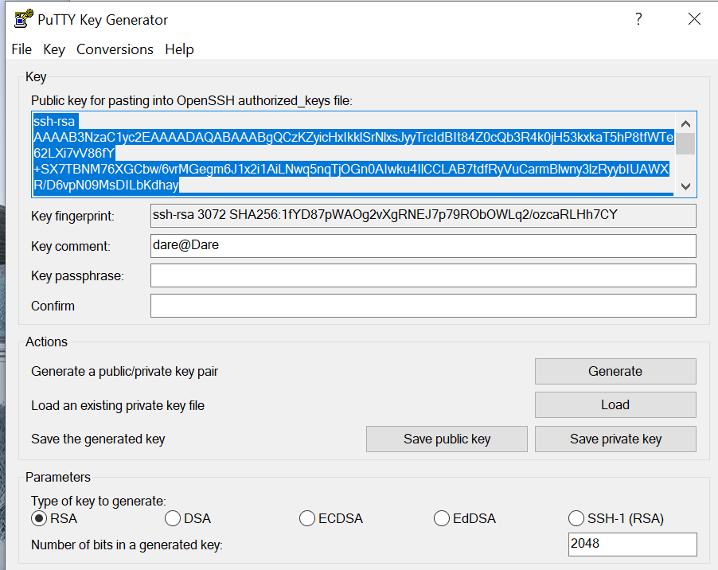

Open PUTTY, click Auth inside the ssh tab, load the just created ppk file.
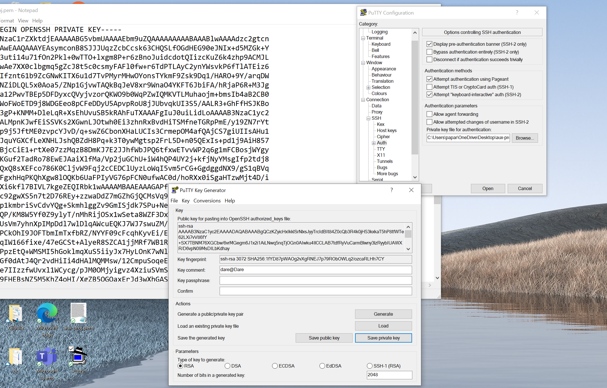

Scroll to the top and click on Session and insert the public ip of the ubuntu server. Click open and accept the prompt
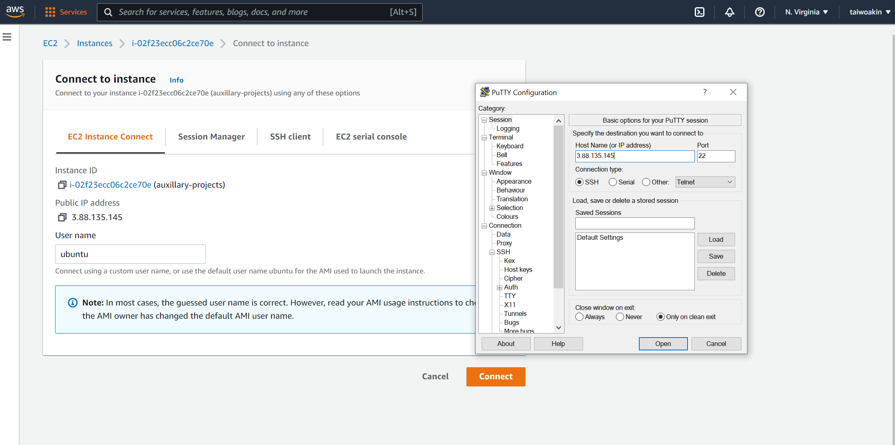

Login as Tammy
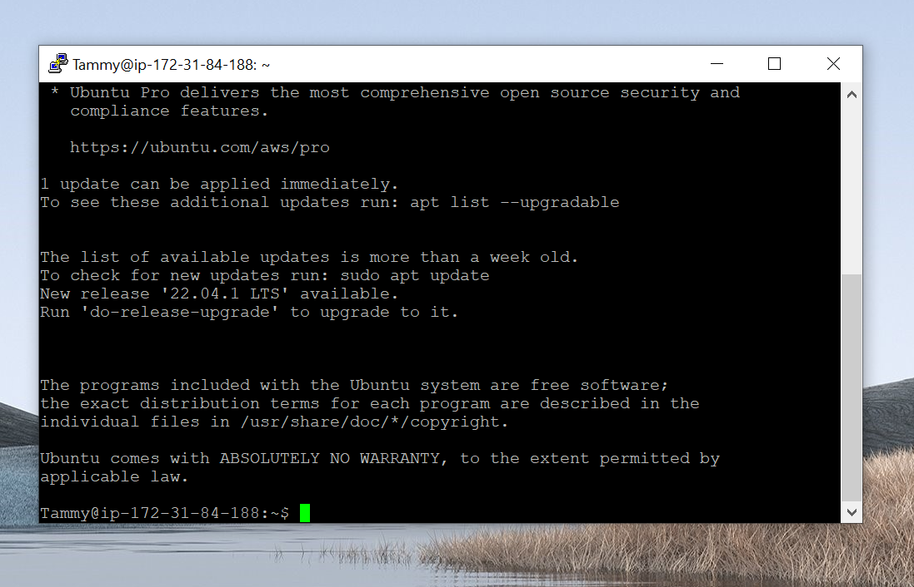

